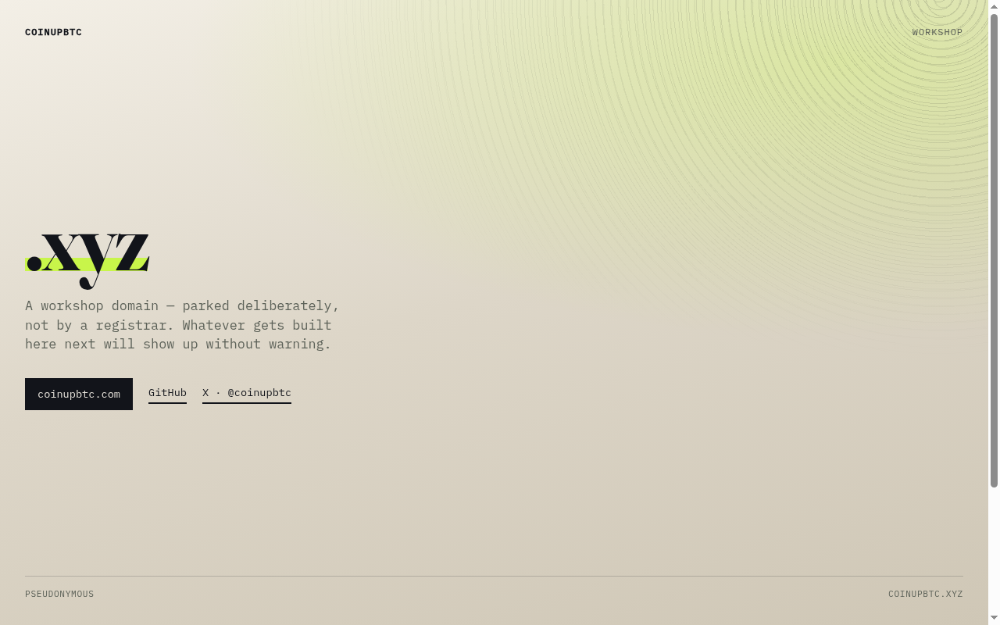
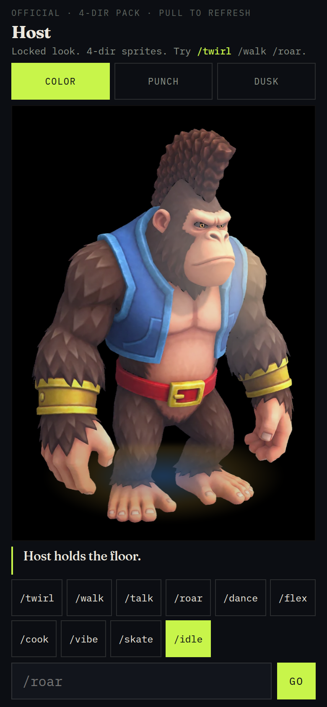

# coinupbtc.xyz — the lab



## At a glance

| | |
|---|---|
| **What it is** | Interactive lab demos you poke in the browser — three measured mechanisms, plus Host. |
| **What it’s for** | Show the mechanism behind work done on my own hardware — not screenshots of it. |
| **How to use it** | Open https://coinupbtc.xyz/ — pick a card. Or `./setup.sh` for a local preview. |

The landing hub is **[coinupbtc.com](https://coinupbtc.com/)**
([repo](https://github.com/Coinupbtc/Coinupbtc.github.io)). This domain is the part you can poke.

## The demos

| | Page | What you do |
|---|---|---|
| 01 | [`demos/mempool.html`](demos/mempool.html) | Drag your fee rate. Watch which simulated block takes you. |
| 02 | [`demos/memory-pack.html`](demos/memory-pack.html) | Pick 1 / 2 / 3 Sparks. Tap models. Watch each 121 GB tank fill. |
| 03 | [`demos/moire.html`](demos/moire.html) | Nudge layer B. The bands are the disagreement — including the site motif. |
| 04 | [`demos/host/`](demos/host/) | Slash-command Host. `/twirl` `/walk` `/roar`. |



## Rules these pages follow

- **Small.** Demos 01–03 are one HTML file each. 04 Host is one HTML file plus sprites.
  No backend, no framework, no build step, no bundler, no dependencies beyond a webfont.
- **No tracking.** No analytics, no cookies, no third-party scripts, no network calls at runtime.
- **Numbers are measured, not asserted.** Demo 02 uses per-Spark residents from this box.
  Where a page is a simplification, it says so.
- **Motion is optional.** Every animation respects `prefers-reduced-motion`.

## Try it

### One command
```bash
git clone https://github.com/Coinupbtc/coinupbtc-xyz.git
cd coinupbtc-xyz && ./setup.sh
# → http://127.0.0.1:8766/
```

### One click
https://coinupbtc.xyz/ — or Host at https://coinupbtc.xyz/demos/host/

Or open `index.html` directly. 01–03 work from `file://`; Host needs the folder (or `./setup.sh`).

## Contact policy

Pseudonymous: no real name, employer, school, phone, or street address.
Inbound: [GitHub](https://github.com/Coinupbtc) · [X @coinupbtc](https://x.com/coinupbtc).

## Stack

Static HTML. Fraunces + IBM Plex Mono via Google Fonts. Design tokens match
`coinupbtc.com` so the two domains read as one brand. The header motif is pure CSS — two
`repeating-radial-gradient` ring sets, no image and no JavaScript.

## Custom domain

`CNAME` → `coinupbtc.xyz`. See [`DNS-PORKBUN.md`](DNS-PORKBUN.md) for the records.

## License

MIT — see `LICENSE`.
